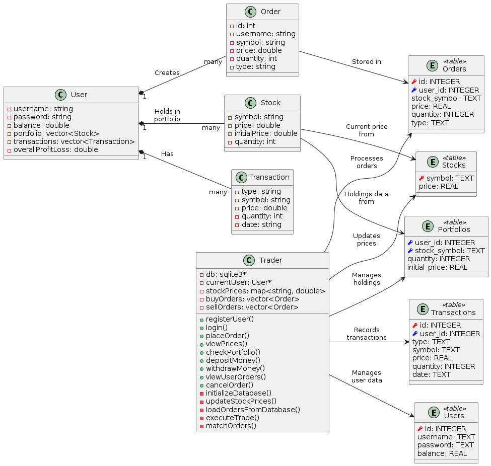

# Stock Exchange System

## 🌟 Overview
This project implements a stock exchange simulation system using C++ and SQLite for persistent data storage. It provides functionalities such as user registration, login, order placement, market price viewing, portfolio management, deposits, and withdrawals.

## 🚀 Features
- **🔒 User Management:** Register and login securely.
- **⚡ Trading Engine:** Place buy/sell orders with automatic matching.
- **📈 Real-Time Updates:** Stock prices update with every trade.
- **💼 Portfolio Management:** Track holdings, account balance, and net worth.
- **📱 Transaction Logging:** Record deposits, withdrawals, and trades.
- **📊 Order Management**  
  - View active user orders.  
  - Cancel open orders by order ID.

## 🏗 Project Structure
 

## 🛠 Prerequisites
- **C++ Compiler:** e.g., g++ (MinGW recommended on Windows)
- **SQLite3 Library**

## 🔧 Setting Up SQLite with MinGW (Windows)

To avoid SQLite errors during compilation and runtime, follow these steps:

1. **Download SQLite Library**

   - Visit the [SQLite download page](https://www.sqlite.org/download.html).
   - Download the Precompiled Binaries for Windows:
     - For 64-bit: `sqlite-dll-win64-x64-*.zip`
     - For 32-bit: `sqlite-dll-win32-x86-*.zip`
   - Choose the version that matches your MinGW architecture (likely 64-bit).

2. **Extract the Library Files**

   - Extract the downloaded ZIP file.
   - You will find two important files:
     - `sqlite3.dll` (the runtime library)
     - `sqlite3.def` (needed to create the import library)

3. **Create Import Library for MinGW**

   - Open Command Prompt as Administrator.
   - Navigate to the directory where you extracted the files.
   - Run the following command to create `libsqlite3.a`:
     ```
     dlltool --def sqlite3.def --dllname sqlite3.dll --output-lib libsqlite3.a
     ```

4. **Install the Library Files**

   - **Copy `sqlite3.h`** to `C:\MinGW\include\` (if it is not already there).
   - **Copy `libsqlite3.a`** to `C:\MinGW\lib\`.
   - **Copy `sqlite3.dll`** to one or more of the following locations:
     - Your project folder
     - `C:\MinGW\bin\`
     - `C:\Windows\System32\`

5. **Compile Your Program Correctly**

   - Use the following command to compile your project with the appropriate include path and library linking:
     ```
     g++ -Iinclude src/main.cpp src/Trader.cpp -lsqlite3 -o StockExchange
     ```
   - Run the executable:
     ```
     .\StockExchange
     ```

## 📜 License
This project is licensed under the MIT License.
